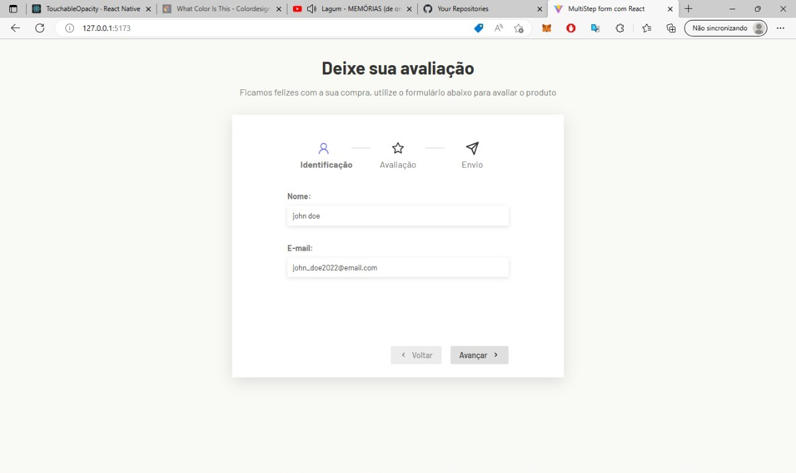
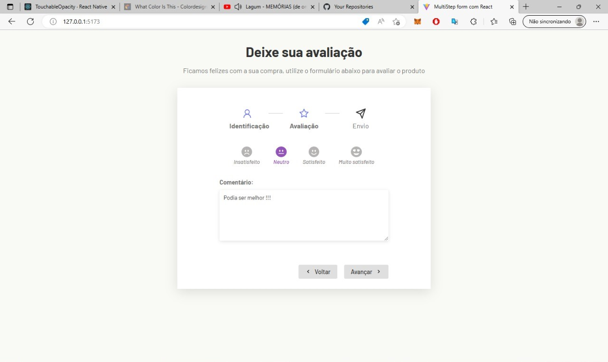
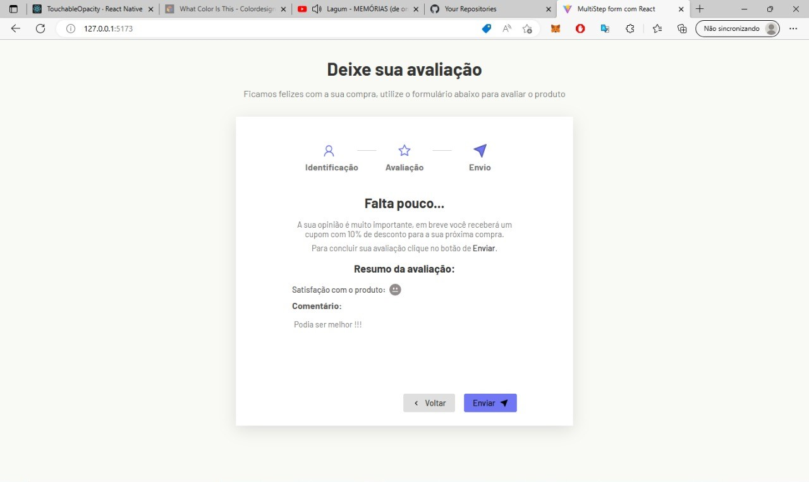

# Formulário multistep

Um exemplo de pequeno formulário multi etapas criado com Reactjs

## Páginas

- Primeira etapa:



- Segunda etapa:



- Terceira etapa:



## Como usar

- clone o repositório:

```git
https://github.com/Lucasm4sco/form-multistep-react.git
```

- acesse a pasta do projeto pelo terminal e execute o comando: ```npm run dev```;

- o comando acima irá gerar um link que poderá ser acessado no navegador.
